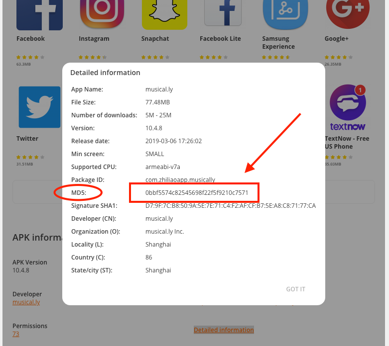

# aptoideAPKdownloader

Tool that can be used to download APKs from the [Aptoide](www.aptoide.com) app store. The tool can download a list of 
APKs from the store that are recorded on a file, or it can download directly an APK using its MD5.

On the [Aptoide store](https://en.aptoide.com/) select the application id (MD5) of the APK that you wish to download, 
that can be found on the end  of the page, under the "**Detailed Information**" link (check the image bellow).



You can build an file with a list of app_ids (MD5) to be downloaded in order for our tool to use!

## Tool usage

In order to use the tool the following command and options can be used:

```
python3 aptoideAPKdownloader.py [-h, --help] [-v, --version] [-f, --file] FILE [-m, --md5] MD5
```

**-h, --help**: Displays the usage of the tool (**optional**).

**-v, --version**: Displays the version of the tool (**optional**).

**-f, --file**: This parameter is mandatory and is used to pass the file that contains the list of application ids (MD5) 
that will be downloaded by the tool. The file will have an app_id (MD5) per line.

**-m, --md5**: Downloads a single APK from Aptoid according to an MD5 app_id.

**Examples**:

```
python3 aptoideAPKdownloader.py -f apks.txt
```
This will download all the APKs, corresponding to the app ids contained in the apks.txt file.

```
python3 aptoideAPKdownloader.py -m 0bbf5574c82545698f22f5f9210c7571
```
This will download a single APK, corresponding to the app id (MD5) selected by the user.
